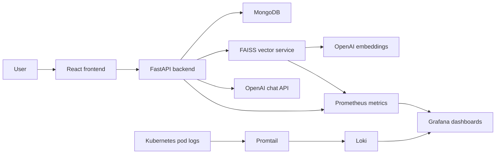

# Healthcare AI Triage Assistant Infrastructure

Local, demo-first infrastructure for a React + FastAPI + MongoDB + FAISS + OpenAI healthcare triage assistant. The assistant is designed to provide symptom guidance, emergency recommendations, disclaimers, and safe fallback responses. It must not provide a final medical diagnosis.

## Architecture



## Folder Structure

```text
backend/                 FastAPI API with /chat, /health, /status, /metrics
frontend/                React demo UI served by nginx
vector-service/          FAISS search API and PDF ingestion pipeline
infra/kind/              Kind cluster config
k8s/base/                Kubernetes app manifests
monitoring/              Prometheus, Grafana, Loki, Promtail manifests
monitoring/helm/         Optional Helm values
scripts/                 Local PowerShell deployment helpers
.github/workflows/       Optional CI/CD workflow
```

## Prerequisites

Install Docker Desktop, Kind, kubectl, and PowerShell. Keep Docker running before creating the cluster.

On Windows, Docker Desktop needs WSL2. If Docker fails with `Docker Desktop is unable to start`, open PowerShell as Administrator and run:

```powershell
.\scripts\install-wsl-admin.ps1
```

Restart Windows, then open Docker Desktop once before continuing.

## Local Deployment Flow

1. Create the Kind cluster named `healthcare-ai`.

```powershell
.\scripts\create-kind-cluster.ps1
```

2. Build Docker images and load them into Kind.

```powershell
.\scripts\build-images.ps1
```

3. Set your OpenAI key and deploy everything.

```powershell
$env:OPENAI_API_KEY="sk-your-key"
.\scripts\deploy.ps1
```

4. Open the demo services.

```text
Frontend:   http://localhost:8080
Grafana:    http://localhost:3000  admin/admin
Prometheus: http://localhost:9090
```

5. Smoke test the deployed API.

```powershell
.\scripts\smoke-test.ps1
```

## Medical PDF Ingestion

Add demo medical PDFs here:

```text
data/medical-pdfs/
```

Recommended sources for the hackathon dataset:

- WHO guidelines
- CDC symptom references
- first-aid guidance
- emergency symptom references

Then run:

```powershell
.\scripts\ingest-docs.ps1 -DocsPath .\data\medical-pdfs
```

The ingestion job chunks PDFs into roughly 400-token chunks, generates OpenAI embeddings, and writes a FAISS index plus chunk metadata into the vector service PVC.

## Kubernetes Components

- `frontend`: React/nginx demo UI exposed on `localhost:8080`
- `backend`: FastAPI API with OpenAI retry, timeout, fallback, and Prometheus metrics
- `mongodb`: single-pod MongoDB with PVC
- `vector-service`: FAISS-backed search API with `/search`, `/health`, `/metrics`
- `prometheus`: scrapes annotated backend and vector-service pods
- `grafana`: preloaded dashboard for API latency, uptime, OpenAI failures, request count, active sessions, pod health, RAG latency, and vector search latency
- `loki` + `promtail`: pod log collection for demo observability

## Useful Commands

```powershell
kubectl -n healthcare-ai get pods
kubectl -n monitoring get pods
kubectl -n healthcare-ai logs deployment/backend
kubectl -n healthcare-ai logs deployment/vector-service
kubectl -n healthcare-ai describe pod -l app=backend
kubectl -n healthcare-ai rollout restart deployment/backend
```

Call the backend through the frontend nginx proxy:

```powershell
Invoke-RestMethod http://localhost:8080/api/health
Invoke-RestMethod -Method Post http://localhost:8080/api/chat -ContentType "application/json" -Body '{"session_id":"demo","message":"I have chest pain and trouble breathing"}'
```

## Optional Helm Setup

For a richer monitoring stack after the demo path works:

```powershell
helm repo add prometheus-community https://prometheus-community.github.io/helm-charts
helm repo add grafana https://grafana.github.io/helm-charts
helm repo update
helm upgrade --install kube-prometheus-stack prometheus-community/kube-prometheus-stack -n monitoring --create-namespace -f monitoring/helm/kube-prometheus-stack-values.yaml
helm upgrade --install loki grafana/loki -n monitoring -f monitoring/helm/loki-values.yaml
```

## Debugging Tips

- `ImagePullBackOff`: run `.\scripts\build-images.ps1` again so images are loaded into Kind.
- `openai_key_configured: false`: set `$env:OPENAI_API_KEY` and rerun `.\scripts\deploy.ps1`.
- Empty RAG results: add PDFs under `data/medical-pdfs` and run `.\scripts\ingest-docs.ps1`.
- Grafana dashboard has no data: hit `/api/chat` a few times, then wait 15-30 seconds for Prometheus scrapes.
- MongoDB readiness is slow on first boot: check `kubectl -n healthcare-ai logs deployment/mongodb`.

## Safety Guardrails

The backend system prompt says not to diagnose, the emergency scoring is rule-based and conservative, and OpenAI failures return:

```text
Unable to confidently assess symptoms. Please consult a healthcare professional.
```
