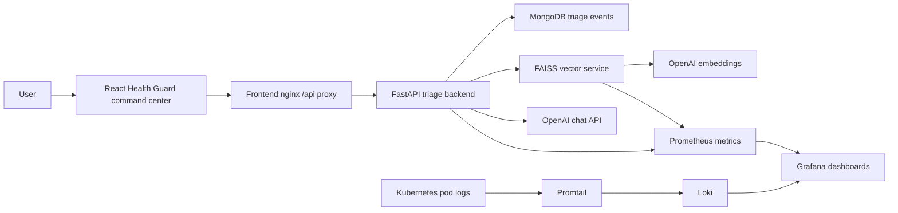

# PulseGuard AI Healthcare Triage Platform

PulseGuard AI is a demo-first AI healthcare triage and operational intelligence platform. It combines a cinematic Health Guard command center frontend with a FastAPI triage backend, FAISS-based RAG retrieval, MongoDB event capture, and Kubernetes observability through Prometheus, Grafana, Loki, and Promtail.

The app is designed for multilingual patient intake, emergency escalation support, clinician-assistive summaries, and operational monitoring. It provides symptom guidance and escalation recommendations, but it must not provide a final medical diagnosis.

Latest frontend update:

- The active React app now uses the merged Health Guard command center UI.
- The new UI calls the real backend `/api/chat` endpoint.
- Backend fields such as risk score, risk level, language, RAG chunks, clinical summary, guidance, safety actions, and escalation recommendation are rendered inside the command center.
- Vite dev mode includes a proxy so `/api` forwards to `http://localhost:8080`.

## Features

- Cinematic React command center for patient intake, triage synthesis, escalation routing, and ICU-style operational review.
- Live symptom submission from the frontend to the backend `/chat` API through `/api/chat`.
- Rule-based emergency score with conservative high-risk keyword detection.
- OpenAI-powered safe guidance with retry, timeout, and fallback behavior.
- RAG retrieval through a FAISS vector service backed by ingested medical PDFs.
- MongoDB triage event persistence for session, message, score, risk level, language, and timestamp.
- Prometheus metrics for request count, latency, active sessions, OpenAI failures, and triage risk score.
- Grafana dashboards for backend, vector service, pod health, RAG latency, and platform health.
- Loki and Promtail log collection for Kubernetes pod logs.
- Local Kind deployment with Docker images loaded directly into the cluster.

## Architecture



## Folder Structure

```text
backend/                  FastAPI API with /chat, /health, /status, /metrics
frontend/                 Vite React app, nginx config, Dockerfile
frontend/src/             Active Health Guard command center source
frontend/contributor-prototype/
                           Preserved standalone contributor prototype/reference UI
vector-service/           FAISS search API and PDF ingestion pipeline
data/medical-pdfs/        Optional source PDFs for RAG ingestion
infra/kind/               Kind cluster configuration and host port mappings
k8s/base/                 Kubernetes app manifests for frontend, backend, MongoDB, vector service
monitoring/               Prometheus, Grafana, Loki, Promtail manifests
monitoring/helm/          Optional Helm values
scripts/                  PowerShell helpers for cluster, build, deploy, smoke test, ingestion
tools/                    Local kubectl.exe expected by scripts
.github/workflows/        Optional CI/CD workflow
```

## Frontend

The frontend is a Vite React app. The latest UI lives in:

```text
frontend/src/HealthGuardPrototype.jsx
```

It renders:

- Patient triage intake with editable symptom text.
- Live backend triage activation.
- Risk-aware telemetry and routing screens.
- Backend-driven AI triage synthesis.
- Escalation recommendation and safety action views.
- Intelligence copilot responses based on the latest backend result.

Development commands:

```powershell
cd D:\Healthcare_Ai\frontend
npm install
npm run dev
```

Open the Vite URL, usually:

```text
http://localhost:5173
```

Production build:

```powershell
cd D:\Healthcare_Ai\frontend
npm run build
npm run preview
```

Dev API behavior:

- The frontend calls `/api/chat`.
- `frontend/vite.config.js` proxies `/api` to `http://localhost:8080`.
- For live triage in dev mode, keep the deployed frontend/backend proxy stack available on `localhost:8080`.

Deployed API behavior:

- nginx serves the built React app.
- nginx forwards `/api/` to the backend service at `http://backend:8000/`.

## Backend API

The backend is a FastAPI service in `backend/app/main.py`.

Endpoints:

```text
GET  /health
GET  /status
GET  /metrics
POST /chat
```

Example deployed request through the frontend nginx proxy:

```powershell
Invoke-RestMethod http://localhost:8080/api/health

Invoke-RestMethod -Method Post http://localhost:8080/api/chat `
  -ContentType "application/json" `
  -Body '{"session_id":"demo","message":"I have chest pain and trouble breathing"}'
```

`POST /chat` returns:

```text
guidance
emergency_score
risk_level
emergency_recommendation
disclaimer
retrieved_context
assistant_name
language
topology_stage
clinical_summary
operational_insights
safety_actions
telemetry
```

The frontend now maps those fields directly into the Health Guard command center.

## Prerequisites

Install:

- Docker Desktop
- Kind
- kubectl
- PowerShell
- Node.js and npm for frontend development

Keep Docker Desktop running before creating the cluster.

On Windows, Docker Desktop needs WSL2. If Docker fails with `Docker Desktop is unable to start`, open PowerShell as Administrator and run:

```powershell
.\scripts\install-wsl-admin.ps1
```

Restart Windows, then open Docker Desktop once before continuing.

The deployment scripts expect:

```text
tools/kubectl.exe
```

## Local Kubernetes Deployment

1. Create the Kind cluster named `healthcare-ai`.

```powershell
.\scripts\create-kind-cluster.ps1
```

2. Build Docker images and load them into Kind.

```powershell
.\scripts\build-images.ps1
```

3. Set your OpenAI key and deploy everything.

```powershell
$env:OPENAI_API_KEY="sk-your-key"
.\scripts\deploy.ps1
```

4. Open the demo services.

```text
Frontend:   http://localhost:8080
Grafana:    http://localhost:3000  admin/admin
Prometheus: http://localhost:9090
```

These host ports come from `infra/kind/cluster.yaml`:

```text
localhost:8080 -> frontend NodePort 30080
localhost:3000 -> Grafana NodePort 30081
localhost:9090 -> Prometheus NodePort 30090
```

5. Smoke test the deployed API.

```powershell
.\scripts\smoke-test.ps1
```

## Medical PDF Ingestion

Add demo medical PDFs here:

```text
data/medical-pdfs/
```

Recommended demo sources:

- WHO guidance
- CDC symptom references
- first-aid guidance
- emergency symptom references

Then run:

```powershell
.\scripts\ingest-docs.ps1 -DocsPath .\data\medical-pdfs
```

The ingestion flow chunks PDFs, generates OpenAI embeddings, and writes a FAISS index plus chunk metadata into the vector service PVC. Empty RAG results usually mean no PDFs have been ingested yet.

## Kubernetes Components

- `frontend`: React/nginx Health Guard command center exposed on `localhost:8080`.
- `backend`: FastAPI triage API with safety constraints, OpenAI retry, timeout, fallback, MongoDB event capture, and Prometheus metrics.
- `mongodb`: single-pod MongoDB with PVC for triage events.
- `vector-service`: FAISS-backed search API with `/search`, `/health`, and `/metrics`.
- `prometheus`: scrapes annotated backend and vector-service pods.
- `grafana`: preloaded dashboard for API latency, uptime, OpenAI failures, request count, active sessions, pod health, RAG latency, and vector search latency.
- `loki` and `promtail`: pod log collection for demo observability.

## Useful Commands

```powershell
kubectl -n healthcare-ai get pods
kubectl -n monitoring get pods
kubectl -n healthcare-ai logs deployment/backend
kubectl -n healthcare-ai logs deployment/vector-service
kubectl -n healthcare-ai logs deployment/frontend
kubectl -n healthcare-ai describe pod -l app=backend
kubectl -n healthcare-ai rollout restart deployment/backend
kubectl -n healthcare-ai rollout restart deployment/frontend
```

Rebuild and redeploy after frontend/backend code changes:

```powershell
.\scripts\build-images.ps1
.\scripts\deploy.ps1
```

## Optional Helm Setup

For a richer monitoring stack after the demo path works:

```powershell
helm repo add prometheus-community https://prometheus-community.github.io/helm-charts
helm repo add grafana https://grafana.github.io/helm-charts
helm repo update
helm upgrade --install kube-prometheus-stack prometheus-community/kube-prometheus-stack -n monitoring --create-namespace -f monitoring/helm/kube-prometheus-stack-values.yaml
helm upgrade --install loki grafana/loki -n monitoring -f monitoring/helm/loki-values.yaml
```

## Debugging Tips

- `ImagePullBackOff`: run `.\scripts\build-images.ps1` again so images are loaded into Kind.
- Frontend loads but live triage fails: confirm `http://localhost:8080/api/health` responds.
- Vite dev UI cannot call `/api/chat`: make sure the deployed proxy stack is running on `localhost:8080`.
- `openai_key_configured: false`: set `$env:OPENAI_API_KEY` and rerun `.\scripts\deploy.ps1`.
- Empty RAG results: add PDFs under `data/medical-pdfs` and run `.\scripts\ingest-docs.ps1`.
- Grafana dashboard has no data: hit `/api/chat` a few times, then wait 15-30 seconds for Prometheus scrapes.
- MongoDB readiness is slow on first boot: check `kubectl -n healthcare-ai logs deployment/mongodb`.
- Windows permission errors during `npm run build`: close running preview/dev processes and retry. If needed, delete old `frontend/dist` files with an elevated shell.

## Safety Guardrails

PulseGuard AI is triage support, not a diagnostic authority.

The backend system prompt says not to diagnose or use certainty claims. The emergency scoring is rule-based and conservative. OpenAI failures return:

```text
Unable to confidently assess symptoms. Please consult a healthcare professional.
```

High-risk symptom patterns such as chest pain or trouble breathing produce emergency escalation recommendations. The frontend keeps the medical disclaimer visible through backend-driven guidance and safety actions.

## Latest Commit Context

The latest merged frontend work is:

```text
560b5f5 Merge Health Guard frontend with backend triage
```

This commit changed the frontend from a standalone visual prototype into a project-integrated command center that uses the real backend triage workflow.
